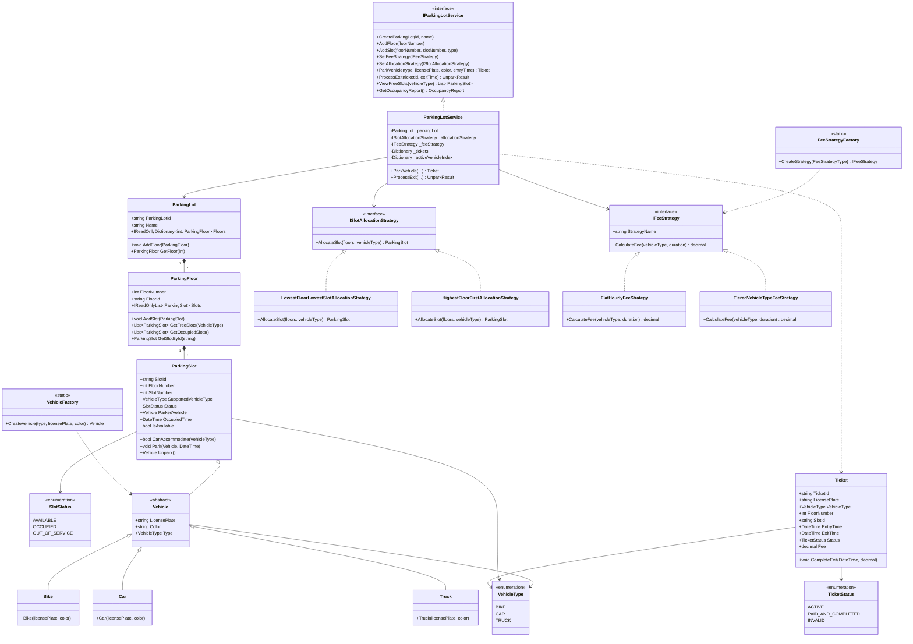

# Extensible Multi-Floor Parking Lot System (LLD)

An enterprise-grade, extensible, console-based **Multi-Floor Parking Lot System** built with **C# (.NET 10)** following Object-Oriented Design (OOD) and SOLID principles.

Repository: [https://github.com/Kishorekola19/Multifloor-Parking-Lot-System.git](https://github.com/Kishorekola19/Multifloor-Parking-Lot-System.git)

---

## 📐 UML / Class Diagram



---

## 🎨 Design Patterns Applied

### 1. Strategy Pattern
- **Purpose**: Decouples algorithm implementations (slot allocation logic and fee calculation algorithms) from the service controller, allowing dynamic runtime swapping.
- **Implementations**:
  - `ISlotAllocationStrategy`:
    - `LowestFloorLowestSlotAllocationStrategy`: Finds the lowest floor with the lowest slot number.
    - `HighestFloorFirstAllocationStrategy`: Alternative strategy allocating slots starting from top floors downwards.
  - `IFeeStrategy`:
    - `FlatHourlyFeeStrategy`: Flat hourly billing rate per vehicle type (`BIKE`=$10/hr, `CAR`=$20/hr, `TRUCK`=$30/hr, rounded up).
    - `TieredVehicleTypeFeeStrategy`: Base rate for first 2 hours, then incremental rate per hour.

### 2. Factory Pattern
- **Purpose**: Encapsulates object creation complexity, enforces parameter validation (e.g. license plate normalization), and eliminates `switch`/`if-else` chains in client code.
- **Implementations**:
  - `VehicleFactory`: Instantiates concrete `Vehicle` types (`Bike`, `Car`, `Truck`).
  - `FeeStrategyFactory`: Creates fee strategies based on `FeeStrategyType` enum.

---

## 🛡️ Edge Cases & Validation Handling

1. **Duplicate Vehicle Parking**:
   - Rejects parking requests if a vehicle with the same license plate is currently parked inside the lot.
   - Throws: `DuplicateVehicleParkingException`.
2. **Unavailable Slots (Lot Full)**:
   - When all slots matching a vehicle type are occupied or marked out-of-service, gracefully prevents allocation.
   - Throws: `SlotUnavailableException`.
3. **Invalid Ticket Processing**:
   - Protects against null, empty, or non-existent ticket IDs during exit.
   - Throws: `InvalidTicketException`.
4. **Repeated Exit Attempt**:
   - Guarantees idempotent operations by rejecting secondary exit attempts on tickets already paid and completed.
   - Throws: `TicketAlreadyExitedException`.

---

## 🚀 How to Build and Run

### Prerequisites
- [.NET 10 SDK](https://dotnet.microsoft.com/)

### Build the Console Application
```bash
dotnet build "Parking Lot Management System.csproj"
```

### Run Main Demonstration Program
```bash
dotnet run --project "Parking Lot Management System.csproj"
```

### Run xUnit Unit Test Suite (12 Unit Tests)
```bash
dotnet test tests/ParkingLotSystem.Tests/ParkingLotSystem.Tests.csproj
```

---

## 💻 Sample Console Output

```text
================================================================================
  EXTENSIBLE MULTI-FLOOR PARKING LOT SYSTEM - LLD DEMO
================================================================================

--------------------------------------------------------------------------------
▶ OPERATION 1: Initializing Parking Lot & Configuring Floors/Slots
--------------------------------------------------------------------------------
✅ Parking Lot 'LOT-01' initialized with 2 Floors and 9 Total Slots.

--------------------------------------------------------------------------------
▶ OPERATION 2: Parking Vehicles (Normal Operations)
--------------------------------------------------------------------------------
[PARK SUCCESS] Ticket[PRK-LOT-01-F1-S1-1000] | Vehicle: KA-01-BK-1001 (BIKE) | Floor: 1 | Slot: F1-S1 | Status: ACTIVE | Entry: 2026-10-04 10:00:00
[PARK SUCCESS] Ticket[PRK-LOT-01-F1-S3-1001] | Vehicle: KA-05-CR-2002 (CAR) | Floor: 1 | Slot: F1-S3 | Status: ACTIVE | Entry: 2026-10-04 10:00:00
[PARK SUCCESS] Ticket[PRK-LOT-01-F1-S5-1002] | Vehicle: KA-03-TR-3003 (TRUCK) | Floor: 1 | Slot: F1-S5 | Status: ACTIVE | Entry: 2026-10-04 10:00:00

--------------------------------------------------------------------------------
▶ OPERATION 3: Viewing Free Slots & Displaying Occupancy Report
--------------------------------------------------------------------------------
📌 Free Car Slots Available:
   - Floor 1, Slot F1-S4 (CAR)
   - Floor 2, Slot F2-S2 (CAR)
   - Floor 2, Slot F2-S3 (CAR)

📊 --- PARKING LOT OCCUPANCY REPORT: 'Grand Central Multi-Floor Parking Lot' ---
   Overall Capacity: 9 slots | Occupied: 3 | Free: 6

   🏢 Floor 1: Total: 5 | Occupied: 3 | Free: 2
      - Bike Free: 1 | Car Free: 1 | Truck Free: 0
   🏢 Floor 2: Total: 4 | Occupied: 0 | Free: 4
      - Bike Free: 1 | Car Free: 2 | Truck Free: 1

--------------------------------------------------------------------------------
▶ OPERATION 4: Validation Edge Case - Attempting Duplicate Vehicle Parking
--------------------------------------------------------------------------------
⚠️ Attempting to park vehicle 'KA-05-CR-2002' again while already parked...
❌ [EXPECTED EXCEPTION CAUGHT] Vehicle with license plate 'KA-05-CR-2002' is already parked in the parking lot.

--------------------------------------------------------------------------------
▶ OPERATION 5: Validation Edge Case - Parking When Slots Are Full
--------------------------------------------------------------------------------
[PARK SUCCESS] Filled second truck slot: F2-S4
⚠️ Attempting to park a 3rd Truck when capacity is 2...
❌ [EXPECTED EXCEPTION CAUGHT] No available parking slot found for vehicle type 'TRUCK'.

--------------------------------------------------------------------------------
▶ OPERATION 6: Unparking Vehicle & Fee Calculation (Flat Hourly Rate)
--------------------------------------------------------------------------------
ℹ️ Unparking Car 'KA-05-CR-2002' (Ticket: PRK-LOT-01-F1-S3-1001). Billed Duration: 3h 15m (rounded up to 4 hrs)
✅ [EXIT COMPLETED]
   Vehicle: CAR [KA-05-CR-2002] (Blue)
   Duration: 3h 15m
   Fee Strategy: Flat Hourly Rate Strategy
   Total Fee Billed: $80.00

--------------------------------------------------------------------------------
▶ OPERATION 7: Validation Edge Case - Attempting Repeated Exit
--------------------------------------------------------------------------------
⚠️ Attempting to unpark using ticket 'PRK-LOT-01-F1-S3-1001' a second time...
❌ [EXPECTED EXCEPTION CAUGHT] Ticket 'PRK-LOT-01-F1-S3-1001' has already been processed and exited.

--------------------------------------------------------------------------------
▶ OPERATION 8: Validation Edge Case - Processing Invalid/Non-Existent Ticket
--------------------------------------------------------------------------------
⚠️ Attempting to exit with invalid ticket ID 'PRK-LOT01-F9-S99-99999'...
❌ [EXPECTED EXCEPTION CAUGHT] Invalid or non-existent ticket ID: 'PRK-LOT01-F9-S99-99999'.

--------------------------------------------------------------------------------
▶ OPERATION 9: Design Pattern Demo - Switching Fee Strategy (Strategy Pattern)
--------------------------------------------------------------------------------
🔄 Fee Strategy switched to: 'Tiered Base + Incremental Rate Strategy'
ℹ️ Processing Bike exit ('KA-01-BK-1001') after 4 hours with Tiered Strategy...
✅ [EXIT COMPLETED]
   Strategy Used: Tiered Base + Incremental Rate Strategy
   Fee Calculation: 4 hours (First 2 hrs = $15.00 base, Next 2 hrs @ $5/hr = $10.00)
   Total Fee Charged: $25.00

--------------------------------------------------------------------------------
▶ OPERATION 10: Design Pattern Demo - Switching Allocation Strategy (Highest Floor First)
--------------------------------------------------------------------------------
🔄 Slot Allocation Strategy switched to: 'HighestFloorFirstAllocationStrategy'
✅ [PARK SUCCESS] Car parked at: Floor 2, Slot F2-S2

--------------------------------------------------------------------------------
▶ PARKING LOT SYSTEM DEMO COMPLETED SUCCESSFULLY!
--------------------------------------------------------------------------------
```

---

## 🔌 Extensibility Guide

1. **Adding a New Vehicle Type (e.g., `ELECTRIC_CAR` or `BUS`)**:
   - Add `ELECTRIC_CAR` to `VehicleType` enum.
   - Create subclass `ElectricCar` inheriting from `Vehicle`.
   - Update `VehicleFactory` to instantiate `ElectricCar`.
   - Update fee dictionary in `FlatHourlyFeeStrategy` / `TieredVehicleTypeFeeStrategy`.
2. **Adding a New Pricing Strategy (e.g., `WeekendPeakFeeStrategy`)**:
   - Create class implementing `IFeeStrategy`.
   - Register in `FeeStrategyFactory`.
   - Call `parkingService.SetFeeStrategy(new WeekendPeakFeeStrategy())`.
3. **Adding a New Allocation Strategy (e.g., `NearestSlotAllocationStrategy`)**:
   - Create class implementing `ISlotAllocationStrategy`.
   - Call `parkingService.SetAllocationStrategy(new NearestSlotAllocationStrategy())`.
